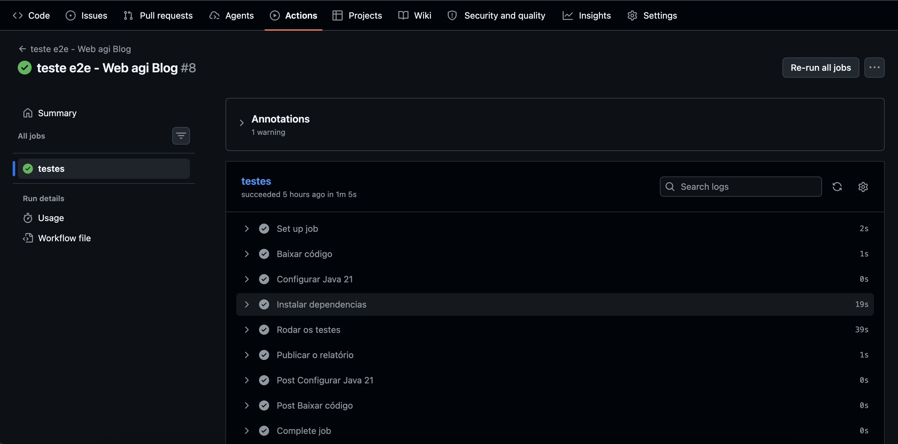
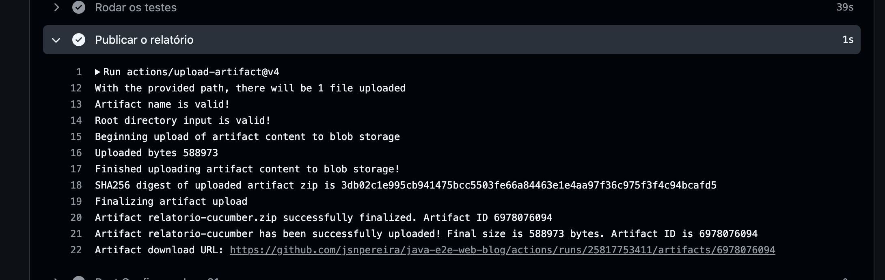
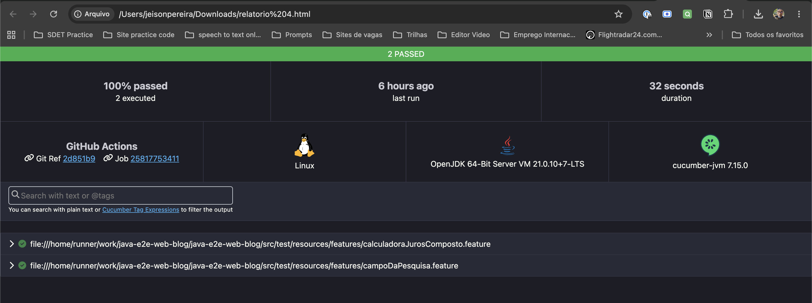

# Java E2E Web Blog

Escolhi utilizar as ferramentas Java, TestNG, Selenium e Cucumber por oferecerem maior robustez e flexibilidade para implementar testes em um site mais complexo, principalmente em cenários com pouca padronização de tags, como ausência de `test-id` ou `cypress-id` nos elementos da página.

Optei pelo Selenium devido ao suporte a XPath, o que facilita a implementação da lógica para localizar elementos através de seus endereços estruturais na página.

A estrutura da automação de testes foi desenvolvida utilizando o padrão POM (Page Object Model), uma boa prática que facilita a manutenção, organização e futuras alterações no código.

---

# Tecnologias utilizadas

- Java
- Selenium
- TestNG
- Cucumber
- Maven
- BrowserStack
- GitHub Actions

---

# Estrutura do Projeto

A estrutura da base do projeto está organizada da seguinte forma:

```text
test/java
├── /Drivers
├── /Pages
├── /Steps
└── TestRunner.java

resources
└── /Features
```

## test/java

### `/Drivers`
Responsável pela configuração e inicialização do driver e navegador.

### `/Pages`
Contém as classes de cada página e seus respectivos elementos.

### `/Steps`
Implementação dos steps responsáveis pela execução das ações dos cenários.

### `TestRunner.java`
Classe responsável por iniciar a execução das features do Cucumber.

---

## resources

### `/Features`
Contém os arquivos `.feature` estruturados no padrão Gherkin.

---

## Raiz do Projeto

### `browserstack.yml`
Responsável pela configuração da execução dos navegadores em ambiente remoto/cloud utilizando o BrowserStack.

### `testng.xml`
Responsável pela configuração e inicialização da suíte de testes do TestNG.

---

# Configuração do DriverFactory

O projeto possui duas configurações de execução:

- Execução local
- Execução remota via CI/CD

---

## Execução Local

```java
private static WebDriver setupDriverLocal() {
    WebDriverManager.chromedriver().setup();

    ChromeOptions options = new ChromeOptions();
    options.addArguments("--remote-allow-origins=*");

    System.setProperty("webdriver.chrome.silentOutput", "true");

    driver = new ChromeDriver(options);

    return driver;
}
```

Essa configuração é utilizada para executar os testes localmente utilizando o navegador Chrome.

---

## Execução Remota - BrowserStack

As configurações abaixo são utilizadas para acessar o BrowserStack e executar os testes em navegadores reais na nuvem.

```java
private static WebDriver setupRemoteDriver() throws MalformedURLException {

    MutableCapabilities capabilities = new MutableCapabilities();
    HashMap<String, Object> bsOptions = new HashMap<>();

    bsOptions.put("userName", System.getenv("BROWSERSTACK_USERNAME"));
    bsOptions.put("accessKey", System.getenv("BROWSERSTACK_ACCESS_KEY"));
    bsOptions.put("buildName", "Blog Agibank E2E");
    bsOptions.put("sessionName", "Calculadora Juros Compostos");

    capabilities.setCapability("browserName", "Chrome");
    capabilities.setCapability("browserVersion", "latest");
    capabilities.setCapability("bstack:options", bsOptions);

    return new RemoteWebDriver(
        new URL("https://hub.browserstack.com/wd/hub"),
        capabilities
    );
}
```

---

## CI/CD - GitHub Actions

Foi configurado um pipeline de CI/CD utilizando GitHub Actions para executar os testes automatizados em ambiente cloud através do BrowserStack.

A execução é realizada utilizando o comando:

```bash
mvn test -Dambiente=ci
```

Ao executar esse comando, o projeto identifica o ambiente configurado no `DriverFactory` e direciona a execução para o BrowserStack, permitindo a execução dos testes em navegadores reais na nuvem.

### Evidências da execução

A imagem abaixo demonstra a execução dos testes no GitHub Actions:



Para facilitar o acesso ao relatório, utilize o step **"Publicar o relatório"**, onde estará disponível o link para download:



No relatório é possível visualizar as informações da execução dos testes, incluindo cenários aprovados e detalhes da execução:



---

## Como executar localmente

Para executar os testes localmente, utilize o comando:

```bash
mvn test
```

Os testes serão executados utilizando o navegador Chrome (caso esteja instalado na máquina).

Não é necessário realizar o download manual do ChromeDriver, pois o projeto utiliza a dependência `WebDriverManager`, responsável por gerenciar automaticamente a instalação e configuração do driver.

```xml
<dependency>
    <groupId>io.github.bonigarcia</groupId>
    <artifactId>webdrivermanager</artifactId>
    <version>6.1.0</version>
</dependency>
```

A configuração automática do ChromeDriver é realizada através do seguinte código:

```java
WebDriverManager.chromedriver().setup();
```
